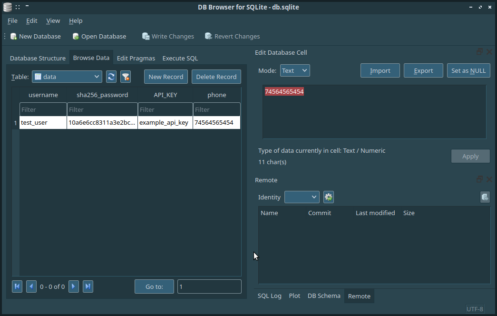

Пятая часть
===

В этом уроке ознакомимся с базами данных. Редко какое приложение обходится без БД. Это довольно удобно для хранения различных параметров. А навыки работы с языком SQL были самыми высокооплачиваемыми в 2019, обогнав и python и java. 

В предыдущей части мы с вами написали приложение, которое позволяет отправлять сообщения на номер телефона.

Однако для полноценного приложения следует добавить авторизацию пользователя. 

Создадим базу данных с следующими полями: ```username```, ```sha256_password```, ```API_KEY```, ```phone```


Получение хэша пароля
```python
import hashlib
password = "test_password"
enc_password = password.encode() # Переводим из текста в байты
hashlib_obj = hashlib.sha256(enc_password) # Получаем хэш
hash_password = hashlib_obj.hexdigest() # Запрашиваем хэш в формате  HEX

print(hash_password) # 10a6e6cc8311a3e2bcc09bf6c199adecd5dd59408c343e926b129c4914f3cb01
```

На сайте добавим страницу входа в систему. Пример обновленного приложения смотри в папке ```app/```

Пример работы с БД находится в файле ```main.py```

Для создания БД рекомендую использовать бесплатное приложение с открытым исходным кодом ```sqlitebrowser```

Полученная БД
---



Далее внесите необходимые исправления в код сайта.

Страница авторизации
---


Страница отправки sms
---
